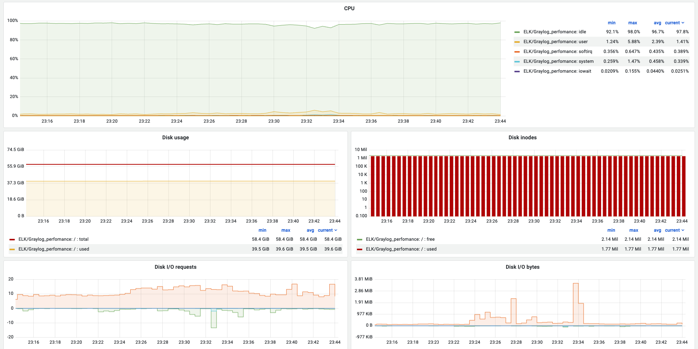

## Description
Collecting mysql slow logs and node app logs with use of ELK stack and graylog as an alternative to kibana. TIG stack is used for perfomance monitoring of seperate components like Filebeats, Logstash, Elasticsearch and overall System perfomance. All screenshots with perfomance results attached below. 

Query: 
bash```
siege -c120 -r10 -b 'http://0.0.0.0:3000/query'```


## Kibana logs dashboard example

Collected mysql slow logs example


## TIG Monitoring 

### Filebeat perfomance 


### Logstash pefomance


### Elasticsearch perfomance


### System overall perfomance





